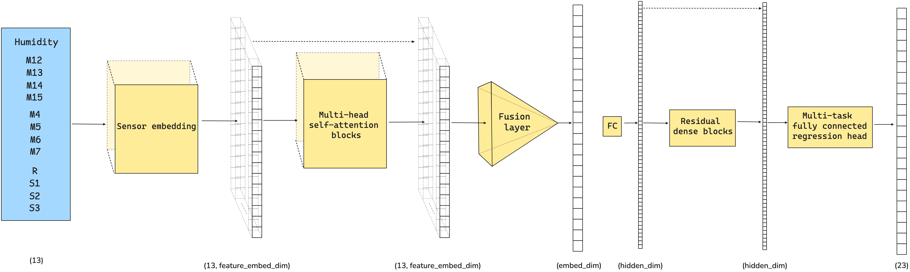

# Toxic Gas Identification

## Residual Attention Multi-Task Network (RAMTNet)

RAMTNet is an advanced neural network designed for toxic gas identification. It
combines self-attention, residual dense blocks, and multi-task learning to efficiently
handle multi-label classification.



## Handling Distribution Shifts with Adversarial Unsupervised Domain Adaptation

To account for distribution shifts between training and deployment environments,
RAMTNet supports adversarial unsupervised domain adaptation (UDA). This method
leverages unlabeled target domain data while preserving knowledge from the source
domain, helping the model generalize better to new environments.

### Installation

To set up the environment, use pyenv and poetry:

```bash
pyenv install 3.12.2
pyenv virtualenv 3.12.2 idgas
pyenv activate idgas
pip install poetry
poetry install
```

### Usage

RAMTNet can be trained using the run_experiment function from nn.py.
Below is an example of training the model with and without UDA.

```python
from nn import run_experiment

params_ramt = {
    "model_class": "RAMTNet",
    "model_params": {
        "num_features": 13,
        "num_tasks": 23,
        "feature_embed_dim": 16,
        "embed_dim": 128,
        "attn_heads": 4,
        "attn_blocks": 2,
        "num_res_blocks": 1,
        "res_hidden": 32,
        "head_hidden": 32,
        "enc_dropout_rate": 0.4,
        "head_dropout_rate": 0.4,
    },
    "training_params": {
        "n_epochs": 150,
        "lr": 5e-4,
        "weight_decay": 1e-4,
        "batch_size": 2048,
        "patience": 12,
        "factor": 0.5,
        "min_lr": 1e-7,
        "lr_warmup_epochs": 2,
        "loss": "WeightedMSELoss",
    },
}

ramtnet = run_experiment(
    x_train,
    y_train,
    x_test,
    val_data, # [(x_val_1, y_val_1), ..., (x_val_n, y_val_n)]
    params=params_ramt,
    uda=True,  # Set to False for training without domain adaptation
    uda_hidden_dim=32,
    uda_dropout_rate=0.0,
    warmup_epochs=150,
    gamma=10.0,
    uda_phase_lr=5e-4,
    uda_disc_lr=5e-4,
    verbose=True,
    plot_losses=True,
    labels=labels,
    zero_weight=1.0,
)
```

You can instantiate a RAMTNet instance, using

```python
from residual_attention_net import RAMTNet

ramtnet = RAMTNet(
    num_features=13,
    feature_embed_dim=16,
    embed_dim=128,
    attn_heads=4,
    attn_blocks=2,
    num_res_blocks=2,
    res_hidden=64,
    head_hidden=64,
    num_tasks=23,
    enc_dropout_rate=0.3,
    head_dropout_rate=0.3,
)
```
